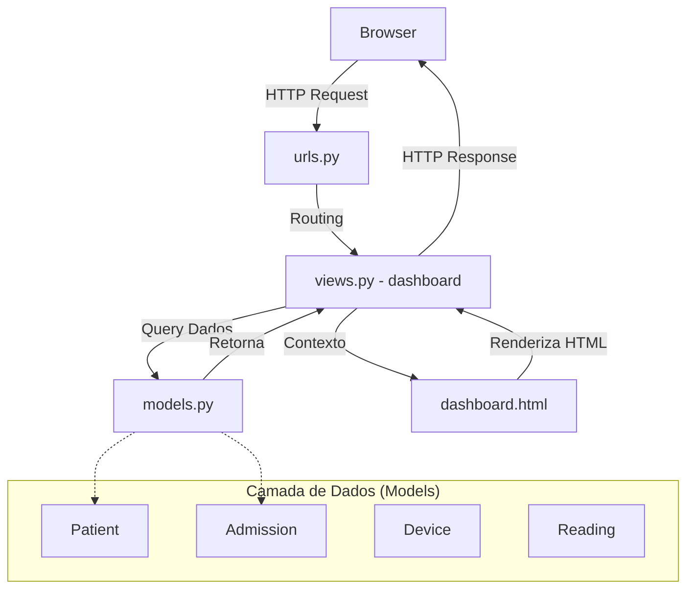
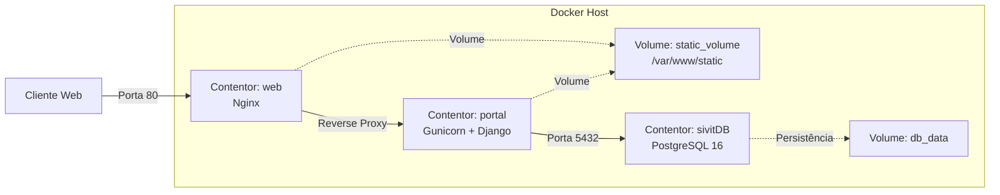

# Diagramas de Arquitetura SIVIT

## Arquitetura de Software (Padrão MVT do Django)
O diagrama seguinte ilustra a estrutura interna da aplicação Django, baseada no padrão Model-View-Template.

---

## Arquitetura de Sistema (Infraestrutura Docker)
O diagrama seguinte ilustra a disposição física dos contentores, o encaminhamento de portas e a segregação de serviços.

